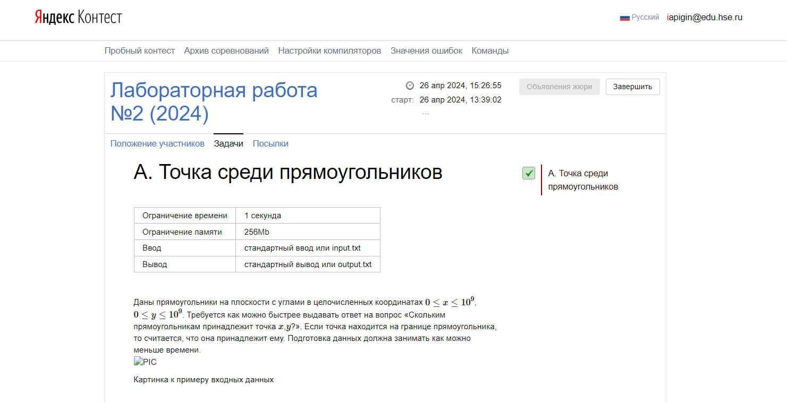
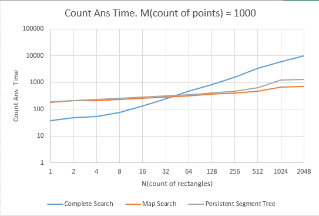
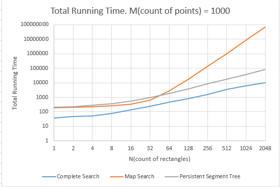
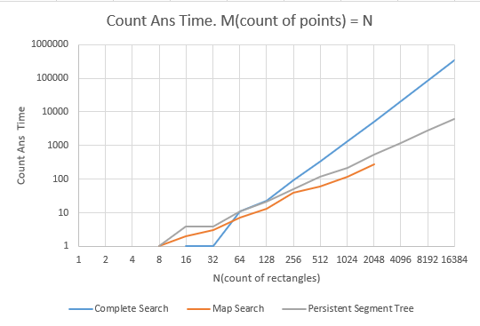
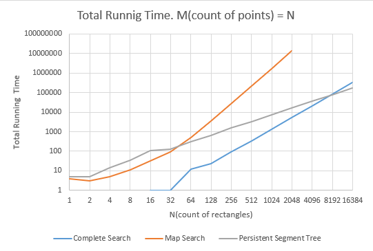

# ALGORITHMS LAB 2

## Выполнил: Пигин Иван Александрович 22ПИ1

## Логин, использованный в контесте: `iapigin@edu.hse.ru`

## Подтверждение прохождения контеста: 

# Описание лабораторной работы 

## Лабораторная работа заключалась в написании трех алгоритмов для нахождения количества прямоугольников, в которые попадают заданные точки, а также выяснении при каком объеме начальных данных и точек какой алгоритм эффективнее.

## Входные данные: `N` - число прямоугольников, `M` - число точек, для которых необходимо дать ответ.

## Реализация точки (хранит значения координат точки).
```c++ 
class Point {
public:
    int x, y;

    Point();
    Point(int x_coord, int y_coord);
    Point(Point& other);
    Point(Point const& other);

};
```

## Реализация прямоугольника (хранит левую нижнюю точку и правую верхнюю точку).
```c++
class Rectangle {
public:
    Point low_left, top_right;

    Rectangle();
    Rectangle(Point p1, Point p2);
    Rectangle(int x1, int y1, int x2, int y2);
    Rectangle(Rectangle& other);
    Rectangle(Rectangle const& other);

};
```

# Алгоритм № 1. Алгоритм полного перебора.

```c++
class CompleteSearch {
private:
    std::vector<Rectangle> rectangles;

public:
    void preprocessing(const std::vector<Rectangle>& rectangles);
    std::vector<ll> countAns(std::vector<Point> points);

};

void CompleteSearch::preprocessing(const std::vector<Rectangle>& rectangles) {
    this->rectangles = rectangles;
}

std::vector<ll> CompleteSearch::countAns(std::vector<Point> points) {
    std::vector<ll> ans(points.size());
    for (int i = 0; i < points.size(); i++) {
        ll curCount = 0;
        for (const auto& rect: rectangles) {
            if (rect.low_left.x <= points[i].x && rect.low_left.y <= points[i].y && rect.top_right.x > points[i].x && rect.top_right.y > points[i].y) {
                curCount++;
            }
        }
        ans[i] = curCount;
    }
    return ans;
}
```

## *Препроцессинг*: `O(1)`. Отсутствует, был осуществлен перенос значений прямоугольников в объект класса, однако этого можно и не делать.

## *Поиск для одной точки*: `O(N)`. *Поиск для M точек*: `O(M * N)`. Проходим по каждому прямоугольнику и проверяем вхождение точки.

## *Сложность по памяти*: `O(1)`.

# Алгоритм № 2. Сжатие координат и построение карты.

```c++
class MapSearch {
private:
    std::vector<std::vector<ll>> map;
    std::vector<int> xUnique, yUnique;

    Point compressPoint(const Point& p);
    void fillMap(const std::vector<Rectangle>& rectangles);
    void selectUniqueCoords(const std::vector<Rectangle>& rectangles);

public:
    void preprocessing(const std::vector<Rectangle>& rectangles);
    std::vector<ll> countAns(std::vector<Point> points);

};

Point MapSearch::compressPoint(const Point& p) {
    Point compressedPoint;
    compressedPoint.x = static_cast<int>((std::lower_bound(xUnique.begin(), xUnique.end(), p.x) - xUnique.begin()));
    compressedPoint.y = static_cast<int>((std::lower_bound(yUnique.begin(), yUnique.end(), p.y) - yUnique.begin()));
    return compressedPoint;
}

void MapSearch::fillMap(const std::vector<Rectangle> &rectangles) {
    map = std::vector<std::vector<ll>>(yUnique.size(), std::vector<ll>(xUnique.size()));
    for (auto& r: rectangles) {
        Point left_border = compressPoint(r.low_left);
        Point right_border = compressPoint(r.top_right);
        for (auto i = left_border.y; i < right_border.y; i++) {
            for (auto j = left_border.x; j < right_border.x; j++) {
                map[i][j] += 1;
            }
        }
    }
}

void MapSearch::selectUniqueCoords(const std::vector<Rectangle>& rectangles) {
    std::set<int> x_coords, y_coords;
    for (auto& r: rectangles) {
        x_coords.insert(r.low_left.x);
        y_coords.insert(r.low_left.y);
        x_coords.insert(r.top_right.x);
        y_coords.insert(r.top_right.y);
    }
    xUnique = std::vector<int>();
    xUnique.insert(xUnique.begin(), x_coords.begin(), x_coords.end());
    yUnique = std::vector<int>();
    yUnique.insert(yUnique.begin(), y_coords.begin(), y_coords.end());
}

void MapSearch::preprocessing(const std::vector<Rectangle>& rectangles) {
    selectUniqueCoords(rectangles);
    fillMap(rectangles);
}

std::vector<ll> MapSearch::countAns(std::vector<Point> points) {
    std::vector<ll> ans(points.size());
    for (int i = 0; i < points.size(); ++i) {
        auto realXvalue = std::upper_bound(xUnique.begin(), xUnique.end(), points[i].x);
        auto realYvalue = std::upper_bound(yUnique.begin(), yUnique.end(), points[i].y);
        if (realXvalue == xUnique.end() || realXvalue == xUnique.begin() || realYvalue == yUnique.begin() || realYvalue == yUnique.end()) {
            ans[i] = 0;
        }
        else {
            ans[i] = map[realYvalue - yUnique.begin() - 1][realXvalue - xUnique.begin() - 1];
        }
    }
    return ans;
}

```

## *Препроцессинг*: `O(N^3)`. Для начала получаем 2 отсортированных множества из x и y координат всех прямоугольников. Для каждого прямоугольника проводим сжатие его x и y координат, а также увеличиваем количество прямоугольников на карте, в соответствующих новых границах.

## *Поиск для одной точки*: `O(logN)`, *поиск для M точек*: `O(M * logN)`. Сжимаем координаты точки с помощью бинарного поиска, поэтому сложность O(logN), далее проверяем, попадает ли точка на карту, и если да, то берем значение из нашей карты в ответ.

## *Сложность по памяти*: `O(N^2)`.

# Алгоритм № 3. Персистентное дерево отрезков.

```c++
class RecMod {
public:
    int x, y1, y2, mod;

    RecMod() : x(0), y1(0), y2(0), mod(0) {}
    RecMod(int new_x, int new_y1, int new_y2, int new_mod) : x(new_x), y1(new_y1), y2(new_y2), mod(new_mod) {}
};

class Node {
public:
    ll start, end, mod;
    std::shared_ptr<Node> left, right;

    Node(ll l, ll r) : start(l), end(r) {
        mod = 0;
        left = nullptr;
        right = nullptr;
    }
    Node() : Node(0, 0) {}
    Node(Node const& node) : Node(node.start, node.end) {
        mod = node.mod;
        left = node.left;
        right = node.right;
    }
};

class PersistentSegmentTree {
private:
    std::vector<int> xUnique, yUnique;
    std::vector<std::shared_ptr<Node>> trees;

    std::shared_ptr<Node> createTree(ll l, ll r);
    std::shared_ptr<Node> modify(const std::shared_ptr<Node>& cur, int l, int r, int mod);
    ll get(const std::shared_ptr<Node>& cur, ll value);
    Point compressPoint(const Point& p);
    void selectUniqueCoords(const std::vector<Rectangle>& rectangles);
    std::vector<RecMod> fillRecMods(const std::vector<Rectangle>& rectangles);
    void buildTree(const std::vector<Rectangle>& rectangles);

public:
    void preprocessing(const std::vector<Rectangle>& rectangles);
    std::vector<ll> countAns(std::vector<Point> points);

};

std::shared_ptr<Node> PersistentSegmentTree::createTree(ll l, ll r) {
    auto root = std::make_shared<Node>(l, r);
    if (l == r) {
        return root;
    }
    ll mid = (l + r) / 2;
    root->left = createTree(l, mid);
    root->right = createTree(mid + 1, r);
    return root;
}

std::shared_ptr<Node> PersistentSegmentTree::modify(const std::shared_ptr<Node>& cur, int l, int r, int mod) {
    if (cur->start >= r || cur->end < l) return cur;
    if (cur->start >= l && cur->end < r) {
        auto newRoot = std::make_shared<Node>(*cur);
        newRoot->mod += mod;
        return newRoot;
    } 
    else {
        auto newRoot = std::make_shared<Node>(*cur);
        newRoot->left = modify(cur->left, l, r, mod);
        newRoot->right = modify(cur->right, l, r, mod);
        return newRoot;
    }
}

ll PersistentSegmentTree::get(const std::shared_ptr<Node>& cur, ll value) {
    ll ans = 0;
    if (cur->right != nullptr && cur->right->start <= value) ans += get(cur->right, value);
    else if (cur->left != nullptr && cur->left->end >= value) ans += get(cur->left, value);
    ans += cur->mod;
    return ans;
}

Point PersistentSegmentTree::compressPoint(const Point& p) {
    Point compressedPoint;
    compressedPoint.x = static_cast<int>((std::lower_bound(xUnique.begin(), xUnique.end(), p.x) - xUnique.begin()));
    compressedPoint.y = static_cast<int>((std::lower_bound(yUnique.begin(), yUnique.end(), p.y) - yUnique.begin()));
    return compressedPoint;
}

void PersistentSegmentTree::selectUniqueCoords(const std::vector<Rectangle>& rectangles) {
    std::set<int> x_coords, y_coords;
    xUnique = std::vector<int>();
    yUnique = std::vector<int>();
    for (const auto& r: rectangles) {
        x_coords.insert(r.low_left.x);
        y_coords.insert(r.low_left.y);
        x_coords.insert(r.top_right.x);
        y_coords.insert(r.top_right.y);
    }
    xUnique.insert(xUnique.begin(), x_coords.begin(), x_coords.end());
    yUnique.insert(yUnique.begin(), y_coords.begin(), y_coords.end());
}

std::vector<RecMod> PersistentSegmentTree::fillRecMods(const std::vector<Rectangle>& rectangles) {
    std::vector<RecMod> mods(rectangles.size() * 2);
    int i = 0;
    for (auto &r: rectangles) {
        Point low_left_point = compressPoint(r.low_left);
        Point top_right_point = compressPoint(r.top_right);
        mods[2 * i] = RecMod(low_left_point.x, low_left_point.y, top_right_point.y, 1);
        mods[2 * i + 1] = RecMod(top_right_point.x, low_left_point.y, top_right_point.y, -1);
        i++;
    }
    std::sort(mods.begin(), mods.end(), [](RecMod a, RecMod b) { if (a.x == b.x) { return a.mod < b.mod; } return a.x < b.x; });
    return mods;
}

void PersistentSegmentTree::buildTree(const std::vector<Rectangle>& rectangles) {
    std::vector<RecMod> mods = fillRecMods(rectangles);
    trees = std::vector<std::shared_ptr<Node>>(xUnique.size());
    std::shared_ptr<Node> startTree;
    if (yUnique.empty()) startTree = nullptr;
    else startTree = createTree(0, yUnique.size() - 1);
    ll modInd = 0, treeInd = 0;
    for (int x = 0; x < xUnique.size(); ++x) {
        std::shared_ptr<Node> curTree;
        if (treeInd == 0) curTree = startTree;
        else curTree = trees[treeInd - 1];
        while (mods[modInd].x == x) {
            curTree = modify(curTree, mods[modInd].y1, mods[modInd].y2, mods[modInd].mod);
            modInd++;
        }
        trees[treeInd++] = curTree;
    }
}

void PersistentSegmentTree::preprocessing(const std::vector<Rectangle>& rectangles) {
    selectUniqueCoords(rectangles);
    buildTree(rectangles);
}

std::vector<ll> PersistentSegmentTree::countAns(std::vector<Point> points) {
    std::vector<ll> ans(points.size());
    for (int i = 0; i < points.size(); i++) {
        auto realXvalue = std::upper_bound(xUnique.begin(), xUnique.end(), points[i].x);
        auto realYvalue = std::upper_bound(yUnique.begin(), yUnique.end(), points[i].y);
        if (realXvalue == xUnique.end() || realXvalue == xUnique.begin() || realYvalue == yUnique.begin() || realYvalue == yUnique.end()) {
            ans[i] = 0;
        }
        else {
            ans[i] = get(trees[realXvalue - xUnique.begin() - 1], realYvalue - yUnique.begin() - 1);
        }
    }
    return ans;
}
```

## *Препроцессинг*: `O(N * logN)`. Аналогично предыдущему алгоритму, получаем 2 отсортированных множества из x и y координат всех прямоугольников. Для каждого прямоугольника заводим массив, в котором будут хранится объекты, отвечающие за координаты точки, далее массив сортируем по возрастанию координаты x, соответственно сложность O(N * logN). Строих начальное дерево отрезков на сжатых координатах. Для каждой сжатой x координаты копируем предыдущее состояние дерева и модифицируем его только, на том отрезке, которому соответствует данный прямоугольник, соответственно получаем персистентное дерево отрезков.

## *Поиск для одной точки*: `O(logN)`, *поиск для M точек*: `O(M * logN)`. Сжимаем координаты точки, обращаемся к дереву отрезков под номером сжатой x координаты и спускаемся до момента сжатой y координаты, собирая модификаторы.

## *Сложность по памяти*: `O(N * logN)`.

# Код, использованный для запуска тестов.

```c++
enum Alg_names {
    Complete_Search, 
    Compression_With_Map, 
    Persistent_Segment_Tree
};

ll measure_time(const std::function<void(void)>& algFunction) {
    auto start = std::chrono::high_resolution_clock::now();
    algFunction();
    auto end = std::chrono::high_resolution_clock::now();
    return std::chrono::duration_cast<std::chrono::microseconds>(end - start).count();
}

int main() {
    int countOfTests = 10, countOfAlgs = 3, countOfPoints = 1000;
    auto bruteForceFirstAlg = CompleteSearch();
    auto compressionWithMapSecondAlg = MapSearch();
    auto segmentTreeThirdAlg = PersistentSegmentTree();

    std::vector<Point> pointsFixedNumber = generateAllPoints(countOfPoints);
    std::ofstream outFixedCountOfPoints("resources/resultsFixedCountOfPoints.txt", std::ios::app);
    std::ofstream outDiffCountOfPoints("resources/resultsDiffCountOfPoints.txt", std::ios::app);
    for(int n = 1; n <= 16384; n*=2) {
        std::vector<Rectangle> rectangles = generateAllRectangles(n);
        std::vector<Point> pointsDiffNumber = generateAllPoints(n);

        std::vector<ll> timePrepFixed(countOfAlgs);
        std::vector<ll> timeCountFixed(countOfAlgs);
        std::vector<ll> timePrepDiff(countOfAlgs);
        std::vector<ll> timeCountDiff(countOfAlgs);

        for(int i = 0; i < countOfTests; i++) {
            if(n <= 2048) {
                timePrepFixed[Complete_Search] += measure_time([&bruteForceFirstAlg, &rectangles]() { bruteForceFirstAlg.preprocessing(rectangles); });
                timeCountFixed[Complete_Search] += measure_time([&bruteForceFirstAlg, &pointsFixedNumber]() { bruteForceFirstAlg.countAns(pointsFixedNumber); });
                
                timePrepFixed[Compression_With_Map] += measure_time([&compressionWithMapSecondAlg, &rectangles]() { compressionWithMapSecondAlg.preprocessing(rectangles); });
                timeCountFixed[Compression_With_Map] += measure_time([&compressionWithMapSecondAlg, &pointsFixedNumber]() { compressionWithMapSecondAlg.countAns(pointsFixedNumber); });
                
                timePrepFixed[Persistent_Segment_Tree] += measure_time([&segmentTreeThirdAlg, &rectangles]() { segmentTreeThirdAlg.preprocessing(rectangles); });
                timeCountFixed[Persistent_Segment_Tree] += measure_time([&segmentTreeThirdAlg, &pointsFixedNumber]() { segmentTreeThirdAlg.countAns(pointsFixedNumber); });
            }
            timePrepDiff[Complete_Search] += measure_time([&bruteForceFirstAlg, &rectangles]() { bruteForceFirstAlg.preprocessing(rectangles); });
            timeCountDiff[Complete_Search] += measure_time([&bruteForceFirstAlg, &pointsDiffNumber]() { bruteForceFirstAlg.countAns(pointsDiffNumber); });
            if(n <= 2048) {
                timePrepDiff[Compression_With_Map] += measure_time([&compressionWithMapSecondAlg, &rectangles]() { compressionWithMapSecondAlg.preprocessing(rectangles); });
                timeCountDiff[Compression_With_Map] += measure_time([&compressionWithMapSecondAlg, &pointsDiffNumber]() { compressionWithMapSecondAlg.countAns(pointsDiffNumber); });
            }
            timePrepDiff[Persistent_Segment_Tree] += measure_time([&segmentTreeThirdAlg, &rectangles]() { segmentTreeThirdAlg.preprocessing(rectangles); });
            timeCountDiff[Persistent_Segment_Tree] += measure_time([&segmentTreeThirdAlg, &pointsDiffNumber]() { segmentTreeThirdAlg.countAns(pointsDiffNumber); });    
        }
        if(n <= 2048) {
            timePrepFixed[Complete_Search] /= countOfTests;
            timeCountFixed[Complete_Search] /= countOfTests;
        
            timePrepFixed[Compression_With_Map] /= countOfTests;
            timeCountFixed[Compression_With_Map] /= countOfTests;
       
            timePrepFixed[Persistent_Segment_Tree] /= countOfTests;
            timeCountFixed[Persistent_Segment_Tree] /= countOfTests;
        }
        if(n <= 2048) {
            outFixedCountOfPoints << n << "\n";
            outFixedCountOfPoints << timePrepFixed[Complete_Search] << " " << timeCountFixed[Complete_Search] << " " << timePrepFixed[Complete_Search] + timeCountFixed[Complete_Search] << "\n";
            
            outFixedCountOfPoints << timePrepFixed[Compression_With_Map] << " " << timeCountFixed[Compression_With_Map] << " " << timePrepFixed[Compression_With_Map] + timeCountFixed[Compression_With_Map] << "\n";

            outFixedCountOfPoints << timePrepFixed[Persistent_Segment_Tree] << " " << timeCountFixed[Persistent_Segment_Tree] << " " << timePrepFixed[Persistent_Segment_Tree] + timeCountFixed[Persistent_Segment_Tree] << "\n";
        }

        timePrepDiff[Complete_Search] /= countOfTests;
        timeCountDiff[Complete_Search] /= countOfTests;
        if(n <= 2048) {
            timePrepDiff[Compression_With_Map] /= countOfTests;
            timeCountDiff[Compression_With_Map] /= countOfTests;
        }
        timePrepDiff[Persistent_Segment_Tree] /= countOfTests;
        timeCountDiff[Persistent_Segment_Tree] /= countOfTests;

        outDiffCountOfPoints << n << "\n";
        outDiffCountOfPoints << timePrepDiff[Complete_Search] << " " << timeCountDiff[Complete_Search] << " " << timePrepDiff[Complete_Search] + timeCountDiff[Complete_Search] << "\n";
        if(n <= 2048) {
            outDiffCountOfPoints << timePrepDiff[Compression_With_Map] << " " << timeCountDiff[Compression_With_Map] << " " << timePrepDiff[Compression_With_Map] + timeCountDiff[Compression_With_Map] << "\n";
        }
        else {
            outDiffCountOfPoints << " " << "\n";
        }
        outDiffCountOfPoints << timePrepDiff[Persistent_Segment_Tree] << " " << timeCountDiff[Persistent_Segment_Tree] << " " << timePrepDiff[Persistent_Segment_Tree] + timeCountDiff[Persistent_Segment_Tree] << "\n";

    }

    return 0;
}
```

## Результаты тестирования для фиксированного количества точек M = 1000 записываются в файл `resources/resultsFixedCountOfPoints.txt`.

## Результаты тестирования для различного количества точек M = N записываются в файл `resources/resultsDiffCountOfPoints.txt`.

# Сырые данные и их генерация.

## Сами сырые данные, то есть координаты всех прямоугольников для каждого значения N и координаты всех точек находятся в файлах `resources/rectangles.txt` и `resources/points.txt`.

## Генерация координат прямоугольников: 
```c++
// Генерация координат прямоугольников
std::vector<Rectangle> generateAllRectangles(int n) {
    std::ofstream out("resources/rectangles.txt", std::ios::app);
    out << n << "\n";
    std::vector<Rectangle> rectangles(n);
    for (int i = 0; i < n; i++) {
        int x1, y1, x2, y2;
        x1 = 10 * i;
        y1 = 10 * i;
        x2 = 10 * (2 * n - i);
        y2 = 10 * (2 * n - i);
        rectangles[i] = Rectangle({x1, y1}, {x2, y2});
        out << x1 << " " << y1 << " " << x2 << " " << y2 << "\n";
    }
    out.close();
    return rectangles;
}
```

## Генерация координат точек:
```c++
// Простые числа
#define X_PRIME 167
#define Y_PRIME 181 

// Алгоритм быстрого возведения в степень по модулю, использованный для более быстрого получения координат точек
ll fastPow(ll num, ll pow, ll mod) {
    if(mod == 1) return 0;
	ll ans = 1;
	while (pow > 0) {
		if ((pow & 1) == 1) {
			ans = (ans * num) % mod;
		}
		pow = pow / 2;
		num = (num * num) % mod;
	}
	return ans;
}

// Генерация координат точек
std::vector<Point> generateAllPoints(int m) {
    std::ofstream out("resources/points.txt", std::ios::app);
    out << m << "\n";
    std::vector<Point> points(m);
    for (int i = 0; i < m; i++) {
        int x, y;
        x = static_cast<int>(fastPow(X_PRIME * i, 31, 20 * m));
        y = static_cast<int>(fastPow(Y_PRIME * i, 31, 20 * m));
        points[i] = Point(x, y);
        out << x << " " << y << "\n";
    }
    return points;
}
```

# Графики.

## График нахождения ответа без препроцессинга при фиксированном количестве точек, M = 1000.



## График нахождения ответа с препроцессингом при фиксированном количестве точек, M = 1000.



## График нахождения ответа без препроцессинга при изменяемом количестве точек, M = N.



## График нахождения ответа с препроцессингом при изменяемом количестве точек, M = N.



# Выводы.

## При фиксированном количестве точек M = 1000, алгоритм полного перебора (`Complete Search`) имеет наилучшии показатели при N от 1 до 2048. Это связано с тем, что ему необходимо обойти достаточно небольшое количество точек. Однако, если обратить внимание на график для нахождения ответа без препроцессинга, то можно заметить, что при N > 32, `Complete Search` проигрывает двум другим алгоритмам, которые имеют примерно одинаковые результаты. Алгоритм на карте(`Map Search`) до N = 2048 обгоняет алгоритм на персистентном дереве отрезков(`Persistent Segment Tree`), однако алгоритм на карте требует слишком длительного препроцессинга, что затруднительно для ожидания при N > 2048, соответственно, при больших N наиболее оптимально будет выбрать `Persistent Segment Tree`, если нам нужно чаще отвечать на запросы точек, чем каждый раз с нуля обрабатывать прямоугольники. Если часто будут меняться начальные координаты прямоугольников, то лучшим выбором будет `Complete Search`, так как препроцессинг не будет занимать лишнего времени.

## При различном количестве точек M = N, до значения N = 8192 также лидирует по времени `Complete Search`, однако после `Persistent Segment Tree` обгоняет его и далее будет только сильнее отрываться от него. Алгоритм на карте (`Map Search`) в данной ситуации показывает себя очень слабо, имея слишком длительные препроцессинг по времени. Если рассматривать только получение ответа, игнорируя препроцессинг, то в данной ситуации алгоритм на карте быстрее, но он осуществляется только до значения N = 2048, далее неоспоримым лидером является `Persistent Segment Tree`.

## Каждый из алгоритмов имеет место быть и является эффективнее других при определенных условиях, описанных выше. При выборе стоит учитывать также фактор ограничения по памяти и поставленной задачи (нужно чаще с нуля перестраивать алгоритм для новых прямоугольников или чаще необходим поиск ответа для новых запросов точек).